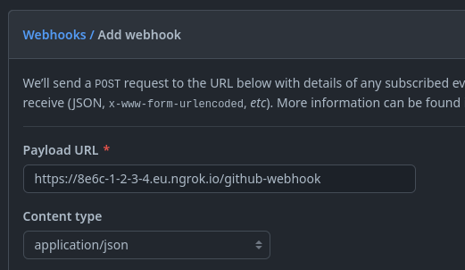

# GitHub Workflows Monitoring

[](https://github.com/midokura/github-workflows-monitoring/actions/workflows/tests.yaml)

## About

Github Workflows Monitoring is a small Python (Flask-based) application that processes [GitHub webhook calls] and logs them.
It tracks each workflow's state (`queued`, `in_progress`, `completed`) and calculates the time spent in each state.

This application can be very useful to gather information about Organization Runners:
- How much time is spent before a job starts processing?
- What repositories are triggering lots of jobs?

The metrics are logged in `logfmt` format to simplify querying them (eg. with Grafana).

[GitHub webhook calls]: https://docs.github.com/en/developers/webhooks-and-events/webhooks/creating-webhooks

## Setup

Go to your **GitHub Organization** >> **Settings** >> **Webhooks** >> **Add new webhook**.

Expose your application to Internet (ngrok, Load Balancer, etc), and **use endpoint** `/github-webhook`.



The **events** that are currently supported are:
- Workflow jobs

## Testing

Into a virtual environment, install the requirements:

```sh
pip install -r tests/requirements.txt
```

To run the tests:

```sh
pytest --cov=src
```
